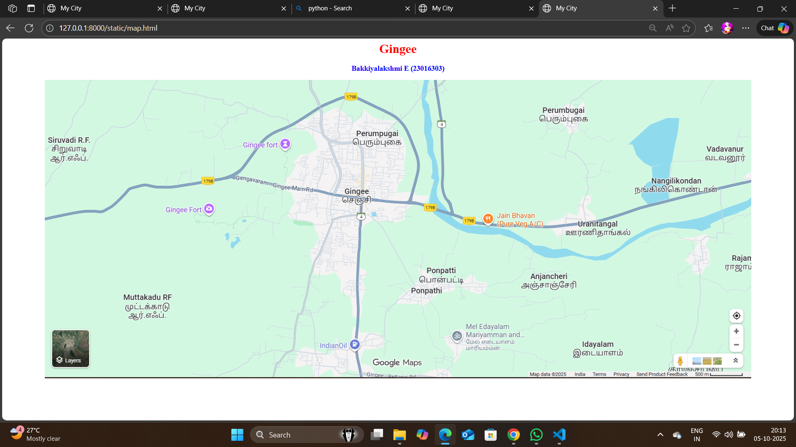
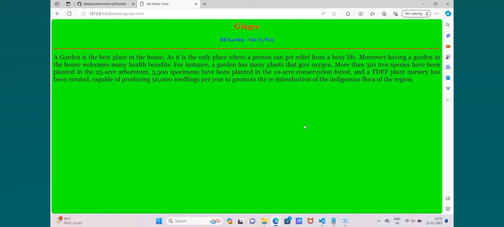
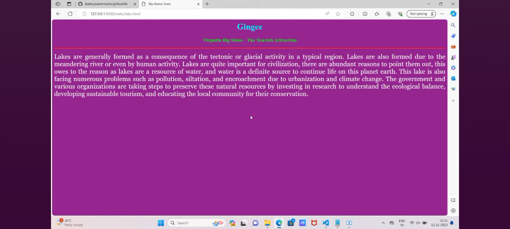
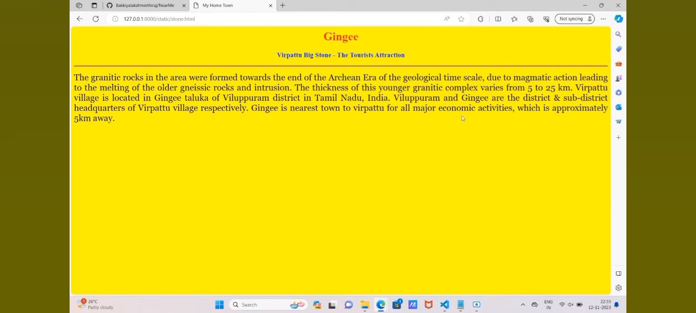
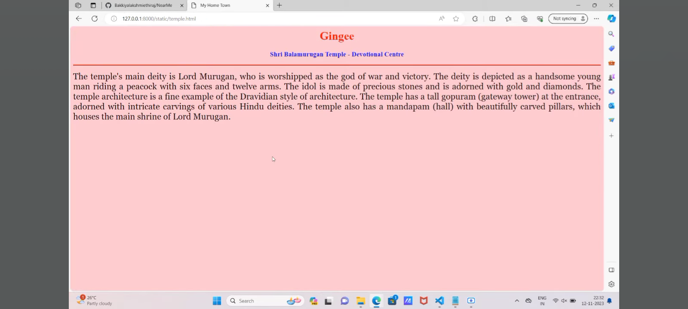
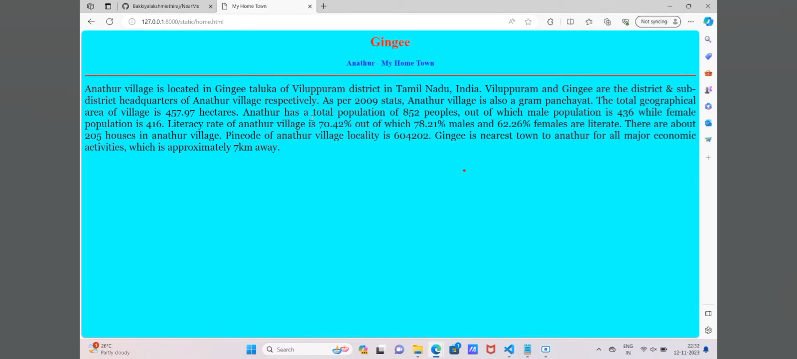

# Ex04 Places Around Me
## Date: 5.10.25

## AIM
To develop a website to display details about the places around my house.

## DESIGN STEPS

### STEP 1
Create a Django admin interface.

### STEP 2
Download your city map from Google.

### STEP 3
Using ```<map>``` tag name the map.

### STEP 4
Create clickable regions in the image using ```<area>``` tag.

### STEP 5
Write HTML programs for all the regions identified.

### STEP 6
Execute the programs and publish them.

## CODE
'''
map.html
<html>
<head>
<title>My City</title>
</head>
<body>
<h1 align="center">
<font color="red"><b>Gingee</b></font>
</h1>
<h3 align="center">
<font color="blue"><b>Bakkiyalakshmi E (23016303)</b></font>
</h3>
<center>

<area shape="rect" coords="700,250,850,400" href="home.html" title="My Home Town">
<area shape="circle" coords="570,230,45" href="temple.html" title="My Temple">
<area shape="circle" coords="640,200,30" href="lake.html" title="Anathur Lake">
<area shape="circle" coords="1120,360,25" href="garden.html" title="RR Garden">
<area shape="rect" coords="950,120,1100,140" href="stone.html" title="Virpattu Big stone">
</map>
</center>
</body>
</html>

garden.html

<html>
<head>
<title>Garden</title>
</head>
<body bgcolor="lime">
<h1 align="center">
<font color="red"><b>Gingee</b></font>
</h1>
<h3 align="center">
<font color="blue"><b>RR Garden - The O<sub>2</sub> Way</b></font>
</h3>
<hr size="3" color="red">
<p align="justify">
<font face="Georgia" size="5">
A Garden is the best place in the house. As it is the only place where a person c
Moreover having a garden in the house welcomes many health benefits. For instance
More than 310 tree species have been planted in the 25-acre arboretum, 5,500 spec
forest, and a TDEF plant nursery has been created, capable of producing 50,000 se
indigenous flora of the region.</font>
</p>
</body>
</html>

home.html

<!DOCTYPE html>
<html>
<head>
<title>My Home Town</title>
</head>
<body bgcolor="cyan">
<h1 align="center"><font color="red"><b>Gingee</b></font></h1>
<h3 align="center"><font color="blue"><b>Anathur - My Home Town</b></font></h3>
<hr size="3" color="red">
<p align="justify">
<font face="Georgia" size="5">
Anathur village is located in Gingee taluka of Villuppuram district in Tamil Nadu, 
are the district & sub-district headquarters of Anathur village respectively. As 
is also a gram panchayat. The total geographical area of village is 457.97 hectar 
of 852 peoples, out of which male population is 436 while female population is 416 
is 70.42% out of which 78.21% males and 62.26% females are literate. There are ab 
Pincode of anathur village locality is 604202. Gingee is nearest town to anathur 
which is approximately 7km away.</font>
</p>
</body>
</html>

lake.html

<!DOCTYPE html>
<html>
<head>
<title>Lake</title>
</head>
<body bgcolor="purple">
<h1 align="center"><font color="cyan"><b>Gingee</b></font></h1>
<font color="lime"><b>Virpattu Big Stone - The Tourists Attraction</b></font>
<h3 align="center"></h3>
<hr size="3" color="red">
<p align="justify">
<font face="Georgia" size="5" color="white">
Lakes are generally formed as a consequence of the tectonic or glacial activity. 
Lakes are also formed due to the meandering river or even by human activity. 
For civilization, there are abundant reasons to point them out, this owes to resource of water, and water is a definite source to continue life on this planet. 
This lake is also facing numerous problems such as pollution, siltation, and climate change. The government and various organizations are taking steps by investing in research to understand the ecological balance, developing sustainable local community for their conservation.
</font>
</p>
</body>
</html>

stone.html

<!DOCTYPE html>
<html>
<head>
<title>My Home Town</title>
</head>
<body bgcolor="purple">
<h1 align="center"><font color="cyan"><b>Gingee</b></font></h1>
<font color="lime"><b>Virpattu Big Stone - The Tourists Attraction</b></font>
<h3 align="center"></h3>
<hr size="3" color="red">
<p align="justify">
<font face="Georgia" size="5" color="white">
Lakes are generally formed as a consequence of the tectonic or glacial activity. 
Lakes are also formed due to the meandering river or even by human activity. 
For civilization, there are abundant reasons to point them out, this owes to resource of water, and water is a definite source to continue life on this planet. 
This lake is also facing numerous problems such as pollution, siltation, and climate change. The government and various organizations are taking steps by investing in research to understand the ecological balance, developing sustainable local community for their conservation.
</font>
</p>
</body>
</html>

temple.html

<html>
<head>
<title>Temple</title>
</head>
<body bgcolor="pink">
<h1 align="center">
<font color="red"><b>Gingee</b></font>
</h1>
<h3 align="center">
<font color="blue"><b>Shri Balamurugan Temple - Devotional Centre</b></font>
</h3>
<hr size="3" color="red">
<p align="justify">
<font face="Georgia" size="5">
The temple's main deity is Lord Murugan, who is worshipped as the god of war and handsome young man riding a peacock with six faces and twelve arms. The idol is made with gold and diamonds. The temple architecture is a fine example of the Dravidian style. a tall gopuram (gateway tower) at the entrance, adorned with intricate carvings or has a mandapam (hall) with beautifully carved pillars, which houses the main shrine.
</font>
</p>
</body>
</html>

'''

## OUTPUT













## RESULT
The program for implementing image maps using HTML is executed successfully.
